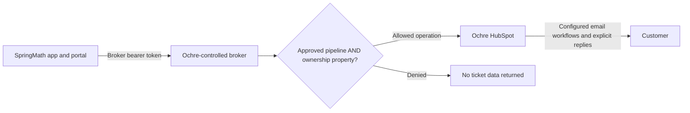

# HubSpot support broker

A small Node.js service that gives SpringMath a **restricted ticket API**, while
the HubSpot account owner retains the underlying account-wide service key.
No runtime dependencies. No database. No generic reverse-proxy route.

## Support handoff and callers

An authenticated AU customer requests human support in Pi. The integration
automatically reuses an exact active requester contact or creates an email-only
contact, creates the Tier 1 ticket, and verifies the contact association before
Pi closes. This happens on support handoff, not as a bulk import of app users.
Ochre Support works the same ticket in the portal and can escalate it to
SpringMath Tier 2. SpringMath staff investigate and return it to Ochre or resolve
it as appropriate. No Zendesk ticket is created; archive is not resolution.

**Tier 2 is work routing, not the initial grant of read access.** Authorized
portal support roles can read in-scope tickets across statuses. Escalated-only
visibility would require an additional server-enforced role policy.

**Both the app server and portal server must use the broker** for the intended
Ochre setup. Routing only the portal through it while the app retains Ochre's
account-wide key would not solve the trust boundary. Neither credential belongs
in a browser. The clients still authenticate users and enforce role permissions;
the broker verifies the fixed account/pipeline/ownership boundary. See
[client integration](#client-integration-is-a-separate-change) for the pending
cutover; this repository does not redirect either deployed client.



For the first demonstration, run this in SpringMath's cluster **against
SpringMath's own test account**. In production, Ochre must control the runtime,
configuration, cluster administration and HubSpot secret. Giving SpringMath an
unrestricted Ochre token and hosting this in a SpringMath-administered cluster
would **not** fix the trust boundary.

## Start here

1. Read [deployment and credential instructions](deployment.md).
2. Configure one account, pipeline, immutable ownership marker, and allowed stages.
3. Start **read-only**; test synthetic allowed and denied tickets.
4. Enable writes only after the account owner accepts the constraints below.

SpringMath's Sydney demo uses [main-branch GitHub Actions deployment](github-deployment.md)
at `https://hubspotproxy.springmath.au`, with one small ARM64 pod, dedicated ECR
repository and namespace-limited OIDC role. See that runbook for release status
and required one-time setup; the existence of this URL is not proof of a rollout.

For Ochre's HubSpot setup, see the [concrete record-boundary plan](access-boundary.md):
the exact custom fields, pipeline, requester/contact association, and dedicated
inbox/thread rules. A shared contact never grants access to that person's
other-brand records. Conversations/email isolation is planned and is **not yet
implemented by this broker**; those routes remain denied.

```sh
npm run check
npm test
node --env-file=/secure/path/hubspot-proxy.local.env src/server.js
```

Use Node.js 24 LTS. The protected env file is outside this public repository.
The [Kubernetes manifests](../k8s/) start with a private ClusterIP service; the
default installation has no public endpoint and writes are disabled.

## Supported API

The paths and ticket-property envelopes resemble HubSpot v3. **Only this subset
is supported**; this is not a drop-in gateway for arbitrary HubSpot SDK calls.
All business routes require `Authorization: Bearer <broker-token>`.

| Method | Path | Restriction |
| --- | --- | --- |
| GET | `/account-info/v3/details` | Only the pinned account ID is returned. |
| GET | `/crm/v3/pipelines/tickets/{pipelineId}` | Only the configured pipeline and allowed stages. |
| POST | `/crm/v3/objects/tickets/search` | Broker ANDs both boundaries into every OR group, fresh-checks results, and computes a scoped count. |
| GET | `/crm/v3/objects/tickets/{ticketId}` | Fresh ownership check; explicit `archived=true` for archived records. |
| GET | `/crm/v3/objects/tickets/{externalId}?idProperty=…` | Only the configured unique conversation-ID property. |
| GET | `/crm/v3/objects/tickets?archived=true` | Bounded internal scan; only scoped archive rows and broker-owned offsets returned. |
| POST | `/crm/v3/objects/tickets` | Forces pipeline, marker and initial stage; privately ensures requester contact and verifies ticket association. |
| PATCH | `/crm/v3/objects/tickets/{ticketId}` | Only the configured shared summary and allowlisted stage. |
| DELETE | `/crm/v3/objects/tickets/{ticketId}` | HubSpot archive/recycling bin, not permanent deletion or resolution. |
| GET | `/springmath/v1/tickets/{ticketId}/notes` | Optional permitted native notes on this scoped ticket; presence-only notice if cross-record notes were withheld. |
| POST | `/springmath/v1/tickets/{ticketId}/notes` | Optional ticket-only internal note; exact account/freshness/body, never a customer email. |
| GET | `/healthz`, `/readyz` | Minimal unauthenticated probes; readiness checks the pinned upstream account. |

Foreign and missing tickets have the same `404 NOT_FOUND` response. Unknown
routes are denied. Clients cannot change pipeline, ownership, requester, external
ID, original subject/content, or arbitrary properties on an existing ticket.

Ticket responses include `id`, explicit `archived`, and only the requested
allowlisted `properties` (plus the mandatory boundary properties). They never
include arbitrary upstream extensions, history, vendor links or contact IDs.

**Not exposed:** contacts lookup/search/edit, arbitrary associations, batch APIs,
companies, deals, schemas, pipeline mutations, restore/permanent delete, generic notes,
email/conversations APIs, marketing data, or arbitrary URLs. The broker uses a
few of those APIs internally for bounded checks; they are not caller routes.

### Optional native internal notes

`BROKER_ENABLE_NOTES=false` by default. When enabled, the custom ticket-bound
notes route supports GET and POST only; POST also requires the existing
write/immutable-scope gates. The upstream credential needs the CRM Notes API
scopes (`crm.objects.contacts.read` / `crm.objects.contacts.write`),
but the broker still exposes no public contact API.

POST body:

```json
{
  "accountId": "50288738",
  "expectedUpdatedAt": "2026-09-10T12:00:00.000Z",
  "body": "Customer-safe internal support investigation note."
}
```

POST returns `201 {"id":"<note-id>","note":{...}}` only after scoped read-back.
The `note` is the single freshly verified projected native record, not a full
history list. This confirms creation independently of the 50-note listing cap.
The broker
constructs the native note-to-ticket association (228); caller associations,
raw HTML, attachments, note IDs and arbitrary properties are not accepted.
GET returns projected `{results:[...],notesWithheld:false}` native CRM note
records, at most 50 and 200KB of raw UTF-8 note HTML. A complete association
page proving a note links to other tickets or known contacts/companies/deals
withholds that note **without fetching its body** and sets `notesWithheld:true`.
The notice exposes no omitted IDs, counts or foreign record metadata; clients
must not claim the returned notes are the full history. Malformed or paginated
associations fail the entire read instead of returning a partial result.
At most three per-note chains run concurrently, preserving metadata-before-body
checks and final ticket scope rechecks within the existing 8MiB cumulative
transfer budget. Use ticket-only notes:
custom-object associations are not exhaustively discoverable by this adapter.

These are shared staff notes, not private SpringMath engineering records or
email messages. The portal's durable dispatch reservation guards approval
replays; this stateless broker does **not** promise idempotent note POSTs.
Never automatically retry an uncertain create. The ownership immutability
constraint below also applies to note associations.

Native customer email needs a ticket-bound Conversations adapter, which is
**not exposed by this broker yet**. The portal's direct-HubSpot demo implementation
refuses email sending when configured with a broker origin.

### Search, counts and pagination

Search supports `filterGroups` (up to three), string `EQ` and `IN` predicates on
allowlisted properties, `query` (HubSpot's text search), `properties`, `limit`
(1–100), and one sort: `subject`, `-subject`, `hs_lastmodifieddate` or
`-hs_lastmodifieddate`. Other operators are rejected, not approximately forwarded.
The simple local string predicate recheck is case-insensitive; scope checks are
always exact. Text relevance still uses HubSpot's eventually consistent index.

`paging.next.after` is a **numeric offset in a recomputed scoped result set**,
never a raw upstream cursor. Concurrent changes can shift pages: this is not a
transactional snapshot. Refresh when investigating a changing queue.

The broker scans bounded candidates and fresh-reads them before counting or
returning data. `total` never comes from an unverified upstream search result.
Default scan ceiling: 1,000 records. Archive listing must scan upstream archive
metadata because HubSpot's archive-list API lacks a brand filter. Unrelated
archive IDs are never returned. A large global archive can therefore exceed the
ceiling even when SpringMath's archive is small. Exceeding a scan/time/4 MiB
retained-data/8 MiB cumulative-transfer budget fails closed; it does not return a misleading partial queue.
This trades throughput for a small, understandable first implementation.

### Ticket creation and requester privacy

Create accepts the normal `{ "properties": { … } }` shape, with `subject`,
`content`, the configured conversation-ID property, and the configured requester
email property. Pipeline, marker and initial stage may be omitted or must match
the configured values exactly. **Caller-supplied `associations` are rejected.**

The authenticated SpringMath server must supply its verified user's email, not
an email invented by a model or taken from ticket prose. The broker trusts that
server assertion; possession of its service token is not end-user authentication.

The broker privately finds the exact-primary-email contact, creates an email-only
contact following a definitive absence, associates it with the ticket, and checks
the saved ticket. It does not expose a general contact-existence API, overwrite
existing profiles, or subscribe the requester to marketing.

Successful create adds:

```json
{ "broker": { "requesterAssociated": true, "emailDelivery": "not_verified" } }
```

For readback/reconciliation, use `verifyRequester=true` on a scoped ticket GET.
This returns `broker.requesterAssociated: true` only after a private exact-email
and association check. It never returns the associated CRM contact IDs.

The conversation-ID property **must have `hasUniqueValue: true` in HubSpot**.
The broker verifies that property definition before creation. Use a namespaced,
high-entropy ID per app conversation. A repeated ID returns `409` and must be
reconciled by reading that ID; never blindly repeat a timed-out ticket POST.
This service never automatically retries a ticket create/update/archive.

### Client integration is a separate change

Current app and portal source has **not** been redirected by this repository.
The portal needs a validated, server-configured broker base URL and broker token.
The pending app's direct contact calls must be replaced with broker-owned
association and `verifyRequester=true` readback. Simply changing the hostname
does not make that pending direct-contact adapter compatible. No fallback to the
unrestricted upstream token is permitted. See the [contract audit](client-contract-audit.md).

## Security model and limits

- One deployment = one HubSpot account, one pipeline, one ownership-marker value.
- Broker keys are independent random credentials; only their SHA-256 digest is
  needed by the server. The upstream key is held only in the owner's secret store.
- HubSpot origin is hardcoded to `https://api.hubapi.com`; redirects and forwarded
  client headers are never used. Caller URLs, credentials and cookies are not forwarded.
- Body/header/response-size limits, rate/concurrency limits, bounded scans and
  timeouts protect this small service. Audit logs contain method, status, safe
  outcome, request ID and elapsed time—not ticket content, emails, URLs or tokens.
- Writes default off. `BROKER_ENABLE_WRITES=true` also requires
  `BROKER_SCOPE_IS_IMMUTABLE=true`, an **operator attestation**, not an enforcement
  feature of HubSpot. The ownership marker **and pipeline must not be reassigned
  concurrently** by other users, workflows or integrations. HubSpot offers no
  atomic conditional PATCH/DELETE based on those fields. A pre-read followed by
  a write has a race; a post-write check cannot undo it. If Ochre cannot prevent
  concurrent reassignment, this design is not sufficient for strict write isolation.
- Offboarding/reclassification procedure: disable broker writes and access,
  drain in-flight operations, reassign in HubSpot, then re-enable only after review.
- Broker-visible shared summaries are not a place for proprietary SpringMath
  engineering details. A note internal to HubSpot may still be visible to Ochre
  staff. Keep SpringMath-only IP in SpringMath-controlled systems.
- Every holder of this initial broker service token can invoke its permitted
  operations. User/role/approval enforcement remains in the trusted portal/app.
  A separate role-specific credential model is future work, not an existing claim.
- The broker is not an email sender. HubSpot must own the sender, recipient,
  reply-thread, permissions and notification workflows. CRM success is not proof
  of email delivery. See the [proposed communication policy](customer-communications.md).

Upstream scopes for the complete planned workflow: `tickets`,
`crm.objects.contacts.read`, `crm.objects.contacts.write`, `conversations.read`
and `conversations.write`. Contact permissions support private requester
association and native CRM notes. The Conversations scopes prepare for the
future ticket-bound email adapter; the current broker still denies those routes.
Required ticket-property metadata must be readable. No schema-write or unrelated
marketing scopes are needed at runtime. Extra upstream privilege never
automatically becomes a broker route. See the [scope-by-purpose table and
implemented-versus-planned boundaries](access-boundary.md).

## Verification and release

`npm test` uses fake data and mocked HubSpot responses plus local HTTP tests. It
does not send emails or mutate HubSpot. Tests cover scope bypasses, OR filters,
stale results, archive paging, response minimization, denied routes/properties,
requester association, unknown write outcomes, bearer handling and resource limits.

CI checks syntax, tests, renders Kubernetes, and builds the container. Merged
`main` pushes trigger the AU deployment workflow after it verifies formal Claude
approval and an identical reviewed source tree. Direct unreviewed pushes cannot
deploy. Optional GHCR publication remains manual; AU uses its own ECR registry.
See [GitHub deployment and rollback](github-deployment.md). A passing test
is not a security assessment or confirmation of an installed Ochre deployment.

Official API references: [HubSpot tickets](https://developers.hubspot.com/docs/api-reference/legacy/crm/objects/tickets/guide),
[CRM search](https://developers.hubspot.com/docs/api-reference/legacy/crm/search-the-crm),
[ticket email automation](https://knowledge.hubspot.com/object-settings/set-up-pipeline-automations-for-objects).
